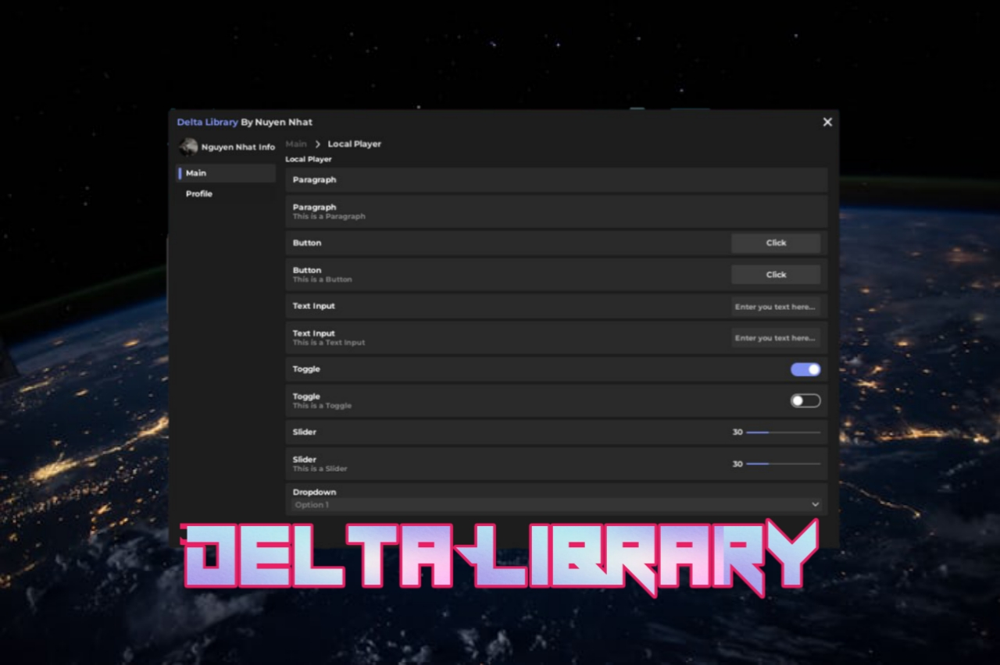

## ⚡ Features

- Modern design
- Many customization options
- Almost any UI Element you would ever need
- Style Fluent Window 11
- Easy to use interface
- Minimalist Style

## ⚙ Documentation

## Booting the Library
```lua
local DeltaLib = loadstring(game:HttpGet("https://raw.githubusercontent.com/NguyenNhatSakura/Delta/refs/heads/main/src/main.lua"))()
```


## Creating a Window
```lua
local DeltaGui = DeltaLib:Start({
    ["Name"] = "Delta Library",
    ["Description"] = "By Nuyen Nhat",
    ["Info Color"] = Color3.fromRGB(5.000000176951289, 59.00000028312206, 113.00000086426735),
    ["Logo Info"] = "rbxassetid://15292705867",
    ["Avatar Dev"] = "rbxassetid://15292705867",
    ["Name Info"] = "Nguyen Nhat Info",
    ["Name Dev"] = "NguyenNhat",
    ["Info Description"] = "github.com/NguyenNhatDino",
    ["Tab Width"] = 135,
    ["Color"] = Color3.fromRGB(127.00000002980232, 146.00000649690628, 242.00000077486038),
    ["CloseCallBack"] = function() end
})

--[[
["Name"] = <string>,
["Description"] = <string>,
["Info Color"] = <userdata>,
["Logo Info"] = <string>,
["Avatar Dev"] = <string>,
["Name Info"] = <string>,
["Name Dev"] = <string>,
["Info Description"] = <string>,
["Tab Width"] = <number>,
["Color"] = <userdata>,
["CloseCallBack"] = <function>
]]
```


## Notifying the user
```lua
local Notify = DeltaLib:Notify({
	["Title"] = "Delta Library",
	["Description"] = "Hello World",
	["Color"] = Color3.fromRGB(127.00000002980232, 146.00000649690628, 242.00000077486038),
	["Content"] = "Delta Library",
	["Time"] = 1,
	["Delay"] = 10
})

--[[
["Title"] = <string>,
["Description"] = <string>,
["Color"] = <userdata>,
["Content"] = <string>,
["Time"] = <number>,
["Delay"] = <number>
]]
```


## Creating a Tab
```lua
local MainTab = DeltaGui:MakeTab("Main")

--[[
DeltaLib:MakeTab(<string>)
]]
```


## Creating a Section
```lua
local Section = MainTab:Section({
    ["Title"] = "Local Player",
    ["Content"] = "Local Player Function"
})

--[[
["Title"] = <string>,
["Content"] = <string>
]]
```


## Creating a Section
```lua
local Section = MainTab:Section({
    ["Title"] = "Local Player",
    ["Content"] = "Local Player Function"
})

--[[
["Title"] = <string>,
["Content"] = <string>
]]
```


## Seperator
```lua
local Seperator = Section:Seperator("My Separator Title")

--[[
Section:Seperator(<string>)
]]
```


## Paragraph
```lua
local Paragraph = Section:Paragraph({
    ["Title"] = "My Paragraph Title",
    ["Content"] = "This is the content of the paragraph."
})

--[[
["Title"] = <string>,
["Content"] = <string>
]]
```


## Paragraph Function
```lua
Paragraph:Set({
    ["Title"] = "New Title",
    ["Content"] = "New Content"
})

--[[
["Title"] = <string>,
["Content"] = <string>
]]
```


## Button
```lua
local Button = Section:Button({
    ["Title"] = "My Button Title",
    ["Content"] = "Click the button to execute the callback.",
    ["Callback"] = function()
        print("Button clicked!")
    end
})

--[[
["Title"] = <string>,
["Content"] = <string>,
["Callback"] = <function>
]]
```


## Text Input
```lua
local TextInput = Section:TextInput({
    ["Title"] = "My TextInput Title",
    ["Content"] = "Enter your text here.",
    ["Place Holder Text"] = "Placeholder...",
    ["Clear Text On Focus"] = true,
    ["Callback"] = function(text)
        print("User entered:", text)
    end
})

--[[
["Title"] = <string>,
["Content"] = <string>,
["Place Holder Text"] = <string>,
["Clear Text On Focus"] = <boolean>,
["Callback"] = <function>
]]
```


## Text Input Function
```lua
TextInput:Set("New Text Content")

--[[
TextInput:Set(<string>)
]]
```


## Toggle
```lua
local Toggle = Section:Toggle({
    ["Title"] = "My Toggle Title",
    ["Content"] = "Toggle the option on or off.",
    ["Default"] = false,
    ["Callback"] = function(value)
        print("Toggle state:", value)
    end
})

--[[
["Title"] = <string>,
["Content"] = <string>,
["Default"] = <boolean>,
["Callback"] = <function>
]]
```


## Toggle Function
```lua
Toggle:Set(true)
print(Toggle.Value)

--[[
Toggle:Set(<boolean>)
print(Toggle.Value)
]]
```


## Slider
```lua
local Slider = Section:Slider({
    ["Title"] = "My Slider Title",
    ["Content"] = "Adjust the value using the slider.",
    ["Min"] = 0,
    ["Max"] = 100,
    ["Increment"] = 1,
    ["Default"] = 50,
    ["Callback"] = function(value)
        print("Slider value:", value)
    end
})

--[[
["Title"] = <string>,
["Content"] = <string>,
["Min"] = <number>,
["Max"] = <number>,
["Increment"] = <number>,
["Default"] = <number>,
["Callback"] = <function>
]]
```


## Slider Function
```lua
Slider:Set(75)
print(Slider.Value)

--[[
Slider:Set(<number>)
print(Slider.Value)
]]
```


## Dropdown
```lua
local Dropdown = Section:Dropdown({
    ["Title"] = "My Dropdown Title",
    ["Multi"] = false,
    ["Options"] = {"Option1", "Option2", "Option3"},
    ["Default"] = {"Option1"},
    ["Place Holder Text"] = "Select an option",
    ["Callback"] = function(selected)
        print("Selected option:", selected)
    end
})

--[[
["Title"] = <string>,
["Multi"] = <boolean>,
["Options"] = <table>,
["Default"] = <table>,
["Place Holder Text"] = <string>,
["Callback"] = <function>
]]
```


## Dropdown Function
```lua
Dropdown:Clear()
Dropdown:Add("New Option")
Dropdown:Set({"Option2"})
Dropdown:Refresh({"Option1", "Option2"}, {"Option1"})
print(unpack(Dropdown.Value))
print(unpack(Dropdown.Options))

--[[
Dropdown:Clear()
Dropdown:Add(<string>)
Dropdown:Set(<table>)
Dropdown:Refresh(<table>, <table>)
print(unpack(Dropdown.Value))
print(unpack(Dropdown.Options))
]]
```


## Multi Dropdown
```lua
local MultiDropdown = Section:Dropdown({
    ["Title"] = "My MultiDropdown Title",
    ["Multi"] = true,
    ["Options"] = {"Option1", "Option2", "Option3"},
    ["Default"] = {"Option1", "Option3"},
    ["Place Holder Text"] = "Select options",
    ["Callback"] = function(selected)
        print("Selected options:", selected)
    end
})

--[[
["Title"] = <string>,
["Multi"] = <boolean>,
["Options"] = <table>,
["Default"] = <table>,
["Place Holder Text"] = <string>,
["Callback"] = <function>
]]
```


## Multi Dropdown Function
```lua
MultiDropdown:Clear()
MultiDropdown:Add("New Option")
MultiDropdown:Set({"Option1", "Option2"})
MultiDropdown:Refresh({"Option1", "Option2"}, {"Option1", "Option2"})
print(unpack(MultiDropdown.Value))
print(unpack(MultiDropdown.Options))

--[[
MultiDropdown:Clear()
MultiDropdown:Add(<string>)
MultiDropdown:Set(<table>)
MultiDropdown:Refresh(<table>, <table>)
print(unpack(MultiDropdown.Value))
print(unpack(MultiDropdown.Options))
]]
```
